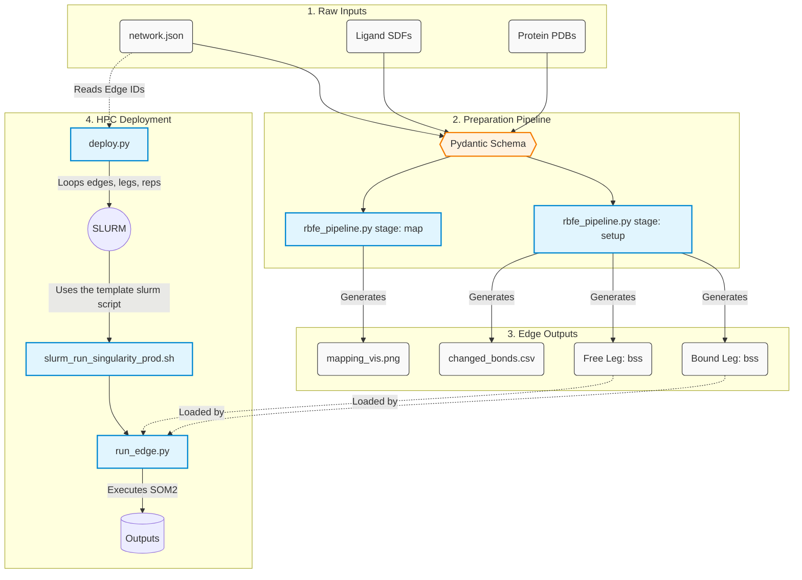

# scaffold-hopping-fep-benchmark

# Instructions

| Script    | Purpose |
| -------- | ------- |
| `rbfe_pipeline_prep.py` | Constructs the alchemical inputs & ready SOMD2 run files from raw inputs |
| `deploy.py` | Deploys the network and built alchemical inputs to HPC processing |
| `slurm_run_singularity_prod.sh` | Sets up the slurm template for individual HPC needs |
| `alchemate_run_edge` | Runs the alchemical transformation using alchemate workflows and SOMD2 |

To process the mappings for a given network
```python
python rbfe_pipeline_prep.py map --network network.json
```
To process the mappings for a given network and a specific edge
```python
python rbfe_pipeline_prep.py map --network network.json --edge ligA_to_ligB

# For example:
python rbfe_pipeline_prep.py map --network networks/zou_network.json --edge-id chk1_c20_to_c17
```
To run the full parametrisation stage and alchemical setup
```python
python rbfe_pipeline_prep.py setup --network network.json
```


# Data Flow


# Software versioning

## Setup software
`biosimspace - 2026.1.0.dev0` (conda install)
`sire - 2026.1.0.dev0`        (conda install)

## Run images
- Default: [2026.05.20](https://hub.docker.com/repository/docker/akalpokas/alchemate_rb/tags/2026.05.20)
- REST2 Angle Tempering: 