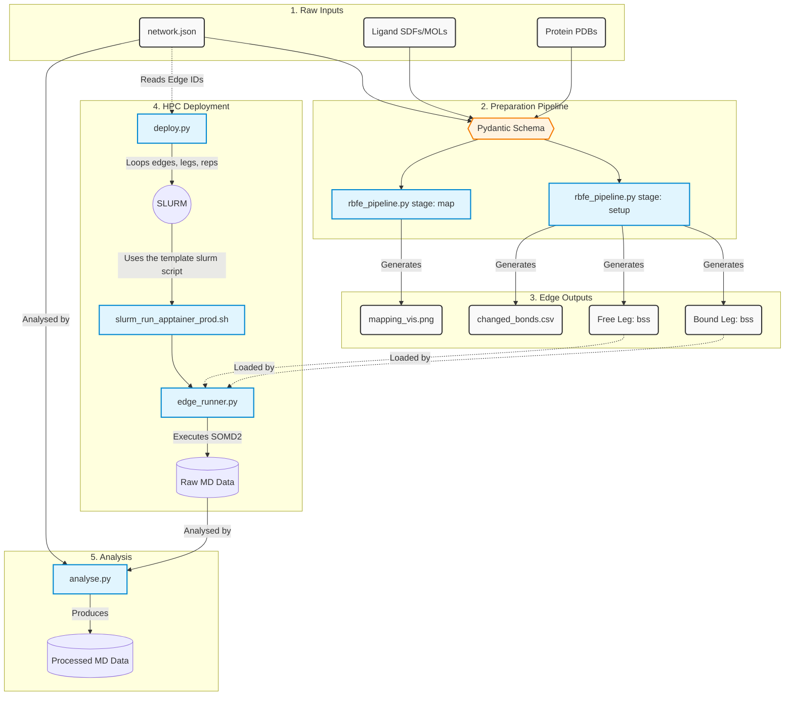

# scaffold-hopping-fep-benchmark

> [!CAUTION]
> The code in this repository is under active development and is not yet ready for general use.

# Software Instructions

## Prerequisites
1. Install docker. See https://docs.docker.com/engine/install/

2. The production pixi/conda environment `sire` shipped in the container is built with `cudatoolkit/cuda-version` version of `12.6` meaning that your compute machine needs a minimum NVIDIA driver version of 560. See https://docs.nvidia.com/cuda/cuda-toolkit-release-notes/

3. To enable GPU support in the container, please make sure that NVIDIA Container Toolkit is installed on your compute machine. Instructions are provided here: https://docs.nvidia.com/datacenter/cloud-native/container-toolkit/latest/install-guide.html

4. For production simulations (multi-user systems, HPCs, etc), use `apptainer` to simplify the execution process. For ubuntu it's recommended to install `apptainer` via `.deb` install as it will update apparmour profiles to allow for seamless image execution. See https://github.com/apptainer/apptainer/blob/main/INSTALL.md#apparmor-profile-ubuntu-2310 for more details.

## Interactive Docker Run

Run interactive docker session

```bash
docker run -it --gpus all akalpokas/alchemate_rb:latest
```

## Production Apptainer Run

```bash
apptainer pull alchemate_rb.sif docker://akalpokas/alchemate_rb:latest # run once
apptainer run --nv /path/to/alchemate_rb.sif python script.py # or somd2 system.bss
```

> [!Important]
> If you are using apptainer version of 1.5.1 or are getting the following error during the build process:
> `While making image from oci registry: error fetching image to cache: while building SIF from layers: while creating squashfs: /usr/libexec/apptainer/bin/mksquashfs command failed:`
> Run:
> `export APPTAINER_IGNORE_PROOT=1`
> And rerun the pull command above.

## Setup software
`biosimspace - 2026.1.0.dev0` (conda install)  
`sire - 2026.1.0.dev0`        (conda install)
`conda create -n openbiosim-dev -c conda-forge -c openbiosim/label/dev biosimspace gromacs`

## Run images
- Default: [2026.06.11](https://hub.docker.com/repository/docker/akalpokas/alchemate_rb/tags/2026.06.11)
- REST2 Angle Tempering: To be built

# Runtime Instructions

> [!NOTE]
> If you are not building your own custom network, you can skip ahead to the [Step 4: Execute the Pipeline](#step-4-execute-the-pipeline)

## Setting Up the RBFE Pipeline

RBFE pipeline relies on a `network.json` file to define the transformations (edges) between different ligands. This file dictates the input files, forcefields, atom mappings, and system parameters required for each simulation. Pre-built networks are provided in the [networks](networks/) folder. Pipeline uses Pydantic validation to ensure the configurations are correct.

## network.json Structure

The `network.json` file contains a list of transformation objects. Each object represents a single edge in your RBFE perturbation network.

Below is a breakdown of the required and optional fields for each transformation object.
1. Identifiers and Metadata

    - `edge_id` (String, Required): A unique identifier for this specific transformation. Example: "chk1_c20_to_c17".
    - `metadata` (Dictionary, Required): Contains pipeline control parameters alongside optional tracking information.
        - `notes` (String, Required): The pipeline relies on this string to determine the alignment merging behavior and the lambda schedule. It must contain one of the following specific phrases:
            - `"standard morph"`: Executes a standard alignment merge and assigns the standard_morph lambda schedule.
            - `"bond annihilation"`: Executes a bond-breaking merge (allowing ring breaking and ring size changes) and assigns the `ring_break_morph` lambda schedule.
            - `"bond creation"`: Executes a bond-breaking merge (allowing ring breaking and ring size changes) and assigns the `ring_make_morph_reverse` lambda schedule.
        - Other keys (Optional): You can add custom key-value pairs here for your own tracking, such as `experimental_ddg_kcal_mol`.

2. Input Files

    The pipeline requires the coordinates and topologies of the system. Multiple files (like a coordinate file and a topology file) can be provided by passing them as a list of strings.

    - `ligand_a_paths` (List of Strings, Required): File paths to Ligand A (e.g., ["inputs/ligands/ligA.sdf"]).
    - `ligand_b_paths` (List of Strings, Required): File paths to Ligand B (e.g., ["inputs/ligands/ligB.sdf"]).
    - `protein_paths` (List of Strings, Required): File paths to the target protein (e.g., ["inputs/proteins/protein.pdb"]).

3. Atom Mapping

    - `mapping` (Dictionary, Required): Defines which atoms in Ligand A correspond to which atoms in Ligand B. The keys represent the atom indices of Ligand A, and the values represent the corresponding atom indices of Ligand B.

4. Forcefield Selection

    - `ligand_ff` (String, Optional): The forcefield used to parameterize the ligands. Defaults to "gaff2". Supported values:
        - `"openff"` (OpenFF forcefield)
        - `"gaff2"` (General AMBER Force Field 2)
        - `"pre_parametrized"` (Use when providing custom topologies)

    - `protein_ff` (String, Optional): The forcefield used to parameterize the protein. Defaults to "amber14". Supported values:
        - `"amber14"` (AMBER14SB)
        - `"pre_parametrized"` (Use when providing custom topologies)

5. Solvation Parameters (Optional)

If you do not specify these, the pipeline defaults to standard solvation settings.
- `solvent_padding_nm` (Float, Optional): The padding distance (in nanometers) between the protein and the edge of the solvent box. Must be ≥0.0. Default is 1.5.
- `ionic_strength_molar` (Float, Optional): The ionic strength of the solvent (in molarity) used to neutralize the system. Must be ≥0.0. Default is 0.15.

## How to Setup and Run a Custom RBFE Pipeline

To execute an RBFE calculation, follow these steps:

### Step 1: Prepare Inputs
Ensure protein and ligand structures are protonated, properly formatted (e.g., .pdb, .sdf, or .mol2), and placed in an accessible inputs/ directory.

### Step 2: Generate Atom Mappings
Determine the common core between your ligand pairs.

### Step 3: Construct network.json
Create the network.json file defining all the edges in your perturbation graph. Here is an example of what a single, fully configured edge looks like:
```JSON
[
  {
    "edge_id": "ligA_to_ligB",
    "metadata": {
      "experimental_ddg_kcal_mol": -0.51,
      "notes": "Bond annihilation"
    },
    "protein_ff": "amber14",
    "ligand_ff": "gaff2",
    "solvent_padding_nm": 1.5,
    "ionic_strength_molar": 0.15,
    "output_dir": "prepared_outputs/target_x/ligA_to_ligB",
    "mapping": {
      "0": 10,
      "1": 9,
      "2": 11
    },
    "ligand_a_paths": ["inputs/ligands/ligA.sdf"],
    "ligand_b_paths": ["inputs/ligands/ligB.sdf"],
    "protein_paths": ["inputs/proteins/protein_water.pdb"]
  }
]
```

## Step 4: Execute the Pipeline
Once the JSON is created, pass it to the pipeline execution scripts.

> [!TIP]
> Network processing tools can be executed granually on different levels:
> - Network-wise
> - Edge-wise
> - Leg-wise
> - Replicate-wise
> - Protocol-wise  
>
> Meaning that if you want to run `edgeA_to_B` from network `X`, but you only want to run the `free leg` replicate `2` using the protocol `Z`, the tools are flexible enough to setup and run these simulations.

`Tools` - Use them to process a network from start to finish.  
`Templates` - Modify them once to align to specific HPC or simulation processing needs.

| Script    | Type | Purpose |
| -------- | -------- | ------- |
| `rbfe_pipeline_prep.py` | Tool | Constructs the alchemical inputs & production ready SOMD2 run files from raw inputs |
| `deploy.py` | Tool | Deploys the network and built alchemical inputs for processing |
| `analyse.py` |  Tool | Runs various analysis workflows on the processed network |
| `slurm_run_apptainer_prod.sh` | Template | Sets up the slurm template for individual HPC needs |
| `edge_runner.py` | Template | Runs the alchemical transformation using alchemate workflows and SOMD2 |
| `clean_runs.py` | Tool | Convenience script for removing previously ran simulations with a specific protocol |

### Alchemical input generation

> [!IMPORTANT]
> Use `python tool.py -h` or `python tool.py --help`  to query the tool for default behaviour. Most tools will default to network-level operations.

To process the mappings for a given network:
```python
python rbfe_pipeline_prep.py map --network network.json
```
To process the mappings for a given network and a specific edge:
```python
python rbfe_pipeline_prep.py map --network network.json --edge ligA_to_ligB

# For example:
python rbfe_pipeline_prep.py map --network networks/zou_network.json --edge-id chk1_c20_to_c17
```
To run the full parametrisation stage and alchemical setup:
```python
python rbfe_pipeline_prep.py setup --network network.json
```

### Network Deployment
To deploy a single replicate testing protocol run for free and bound legs:
```python
python deploy.py --network networks/zou_network.json --protocol testing --leg both --replicate 1
```

Currently implemented protocols
| Protocol | Purpose |
| -------- | ------- |
| `testing` | Runs a short simulation to test stability of the edge and records force components for crash debugging |
| `prod` | Runs a full production simulation with high performance settings |
| `long` | Same as `prod` above, however this protocol is meant for longer sampling of transformations that might be harder to convege |

### Analysis

To run a basic analysis workflow on all 1st free leg replicates in a given network:
```python
python analyse.py --network networks/zou_network.json --modules energy_traj --protocol testing --leg_name free --k 125 --de 50 --replicate 1
```

# Data Flow
