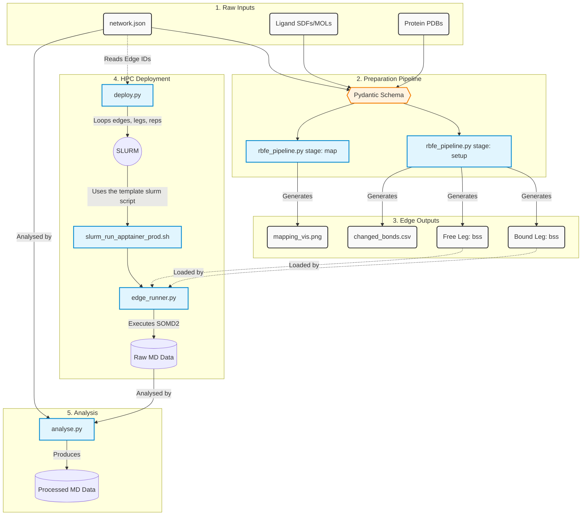

# scaffold-hopping-fep-benchmark

> [!CAUTION]
> The code in this repository is under active development and is not yet ready for general use.

# Instructions

Tools - Use them to process a network from start to finish.  
Templates - Modify them once to align to specific HPC or simulation processing needs.

| Script    | Type | Purpose |
| -------- | -------- | ------- |
| `rbfe_pipeline_prep.py` | Tool | Constructs the alchemical inputs & production ready SOMD2 run files from raw inputs |
| `deploy.py` | Tool | Deploys the network and built alchemical inputs for processing |
| `analyse.py` |  Tool | Runs various analysis workflows on the processed network |
| `slurm_run_apptainer_prod.sh` | Template | Sets up the slurm template for individual HPC needs |
| `edge_runner.py` | Template | Runs the alchemical transformation using alchemate workflows and SOMD2 |
| `clean_runs.py` | Tool | Convenience script for removing previously ran simulations with a specific protocol |

## Alchemical input generation
To process the mappings for a given network:
```python
python rbfe_pipeline_prep.py map --network network.json
```
To process the mappings for a given network and a specific edge:
```python
python rbfe_pipeline_prep.py map --network network.json --edge ligA_to_ligB

# For example:
python rbfe_pipeline_prep.py map --network networks/zou_network.json --edge-id chk1_c20_to_c17
```
To run the full parametrisation stage and alchemical setup:
```python
python rbfe_pipeline_prep.py setup --network network.json
```

## Network Deployment
To deploy a single replicate testing protocol run for free and bound legs:
```python
python deploy.py --network networks/zou_network.json --protocol testing --leg both --replicate 1
```

## Analysis

To run a basic analysis workflow on all 1st free leg replicates in a given network:
```python
python analyse.py --network networks/zou_network.json --modules energy_traj --protocol testing --leg_name free --k 125 --de 150 --replicate 1
```

# Data Flow


# Software versioning

## Setup software
`biosimspace - 2026.1.0.dev0` (conda install)
`sire - 2026.1.0.dev0`        (conda install)

## Run images
- Default: [2026.05.20](https://hub.docker.com/repository/docker/akalpokas/alchemate_rb/tags/2026.05.20)
- REST2 Angle Tempering: 